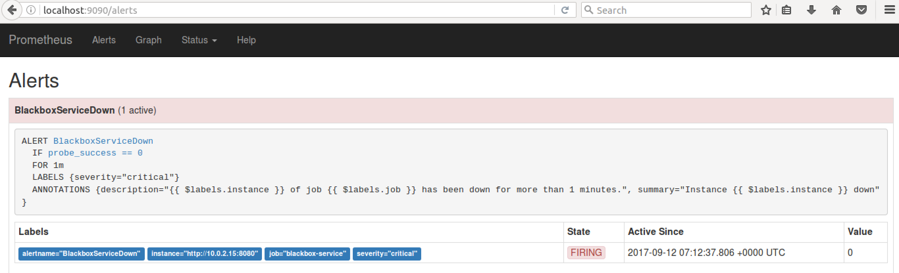

# Blackbox Exporter in Practice
Title:       Blackbox Exporter in Practice  
Project:     Blackbox Exporter  
Author:      Lilly Wu  
Date:        September 12, 2017  

The blogpost is for the user who is familiar with prometheus and alertmanager but has no idea of blackbox exporter setup.
Blackbox exporter is used to expose metrics to prometheus as other exporters. Specially, it's for probing endpoints over **HTTP, HTTPS, DNS, TCP and ICMP**.

This is a hands-on blog, so not much detail blackbox exporter information will be introduced but practical setup and usage will be demoed below.

## Scenario
Monitoring nginx service in prometheus. Once it's down, an alert will be triggered

**Prerequisite**:
1. prometheus and alertmanager are ready on local host
2. docker installed

## Step 1: Fake a web service
Setup a nginx service on the host
```
root@ubuntu1404-dev:~# docker run --name blackbox-nginx -d -p 8080:80 nginx

root@ubuntu1404-dev:~# docker ps
CONTAINER ID        IMAGE               COMMAND                  CREATED             STATUS              PORTS                    NAMES
c6f66172a5cb        nginx               "nginx -g 'daemon off"   7 minutes ago       Up 1 seconds        0.0.0.0:8080->80/tcp     blackbox-nginx
```

## Step 2: Install Blackbox exporter
Setup blackbox with configuration and running container
### configuration
  blackbox.yml

  ```
  modules:
  http_2xx:
    prober: http
    timeout: 5s
    http:
      method: GET
      no_follow_redirects: false
      fail_if_ssl: false
      fail_if_not_ssl: false
      fail_if_matches_regexp:
      - "Failed to connect"
  ```

### run
  ```
  root@ubuntu1404-dev:~/prom/exporters/blackbox_exporter# docker run -d -p 9115:9115 --name blackbox_exporter -v $(pwd)/blackbox.yml:/etc/blackbox_exporter/config.yml prom/blackbox-exporter

  root@ubuntu1404-dev:~/prom/exporters/blackbox_exporter# docker ps
  CONTAINER ID        IMAGE                    COMMAND                  CREATED             STATUS              PORTS                    NAMES
  64148b321855        prom/blackbox-exporter   "/bin/blackbox_export"   3 seconds ago       Up 2 seconds        0.0.0.0:9115->9115/tcp   blackbox_exporter
  ```


## Step 3: Configure Prometheus
configure promtheus to scrape blackbox exporter and alerts in prometheus side
### configure prometheus.yaml
  ```
  - job_name: 'blackbox-service'
    scrape_interval: 10s
    scheme: http
    metrics_path: /probe
    params:
      module: [http_2xx]  # Look for a HTTP 200 response.
    static_configs:
      - targets:
        - http://10.0.2.15:8080   # Target to probe with http on port 8080.
    relabel_configs:
      - source_labels: [__address__]
        target_label: __param_target
      - source_labels: [__param_target]
        target_label: instance
      - target_label: __address__
        replacement: 10.0.2.15:9115  # Blackbox exporter.
  ```

### configure alert.rules
```
ALERT BlackboxServiceDown
  IF probe_success == 0
  FOR 1m
  LABELS { severity = "critical" }
  ANNOTATIONS {
    summary = "Instance {{ $labels.instance }} down",
    description = "{{ $labels.instance }} of job {{ $labels.job }} has been down for more than 1 minutes.",
  }
```

## Demo

### 1. Fake nginx service down
```
root@ubuntu1404-dev:~/prom# docker stop blackbox-nginx
blackbox-nginx

root@ubuntu1404-dev:~/prom# curl -v http://10.0.2.15:8080
* Rebuilt URL to: http://10.0.2.15:8080/
* Hostname was NOT found in DNS cache
*   Trying 10.0.2.15...
* connect to 10.0.2.15 port 8080 failed: Connection refused
* Failed to connect to 10.0.2.15 port 8080: Connection refused
* Closing connection 0
curl: (7) Failed to connect to 10.0.2.15 port 8080: Connection refused

root@ubuntu1404-dev:~/prom# docker logs blackbox_exporter  --tail 10
time="2017-09-12T07:14:30Z" level=error msg="Error for HTTP request to http://10.0.2.15:8080: Get http://10.0.2.15:8080: dial tcp 10.0.2.15:8080: getsockopt: connection refused" source="http.go:178"
time="2017-09-12T07:14:40Z" level=error msg="Error for HTTP request to http://10.0.2.15:8080: Get http://10.0.2.15:8080: dial tcp 10.0.2.15:8080: getsockopt: connection refused" source="http.go:178"
```
### 2. Check Prometheus dashboard


